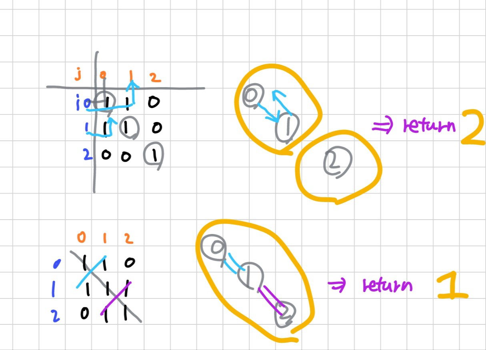

문제번호     n	computers	return
1번 3	[[1, 1, 0], [1, 1, 0], [0, 0, 1]]	2
2번 3	[[1, 1, 0], [1, 1, 1], [0, 1, 1]]	1

---
이 문제에 대한 해결하는
나의 아이디어는

문제1번: (1,0)과(0,1)을 같은거라고 봐서
3 - 1 = 2
결과: 2개의 네트워크

문제2번 : (1,0)과(0,1)을 같은거, (2,1)과(1,2)를 같은거라고 생각해서
3 - 2 = 1
결과: 1개의 네트워크

이런식으로 규칙이 있길래

set<set> setValue 에다가 이중배열에서 1의 값을 갖는 (1,0)과(0,1),  (2,1)과(1,2) 을 넣어서
n - setValue 를 return 하려고 했어

----

아이디어 자체는 흥미롭지만, 문제를 완전히 해결하기에는 몇 가지 보완이 필요합니다. 문제의 본질은 "연결된 노드들이 하나의 네트워크를 형성하는지"를 판별하는 것이므로, 단순히 Set에 값들을 넣고
n
−
setValue.size()
n−setValue.size()를 계산하는 방식으로는 정확한 결과를 얻기 어렵습니다.
---
왜 Set<Set> 방식이 문제를 완전히 해결하지 못하나?

1. 네트워크 연결의 본질
   문제는 단순히 (i, j)와 (j, i)가 같은지를 확인하는 것이 아니라, 노드 간의 연결 경로를 통해 같은 네트워크에 속하는지를 판별해야 합니다. 예를 들어:

- Node A↔Node B↔Node C가 연결되어 있다면, 이는 하나의 네트워크로 간주됩니다.
- 하지만 Set에 (A, B)와 (B, C)를 각각 추가하더라도, 이 두 노드가 같은 네트워크인지 여부를 판별할 방법이 없습니다.

2. 간선만으로는 연결 관계를 모두 표현할 수 없음
   단순히 (i, j)를 Set에 넣는 방식은 연결 관계의 트랜지티브(전이적) 속성을 고려하지 않습니다. 예를 들어:

- A↔B이고 B↔C라면, A와 C도 같은 네트워크에 속해야 합니다.
- 그러나 이 방식은 (A, B)와 (B, C)를 별도로 저장할 뿐, 이를 하나의 네트워크로 통합하지 못합니다.

---